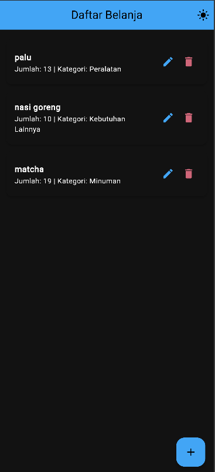
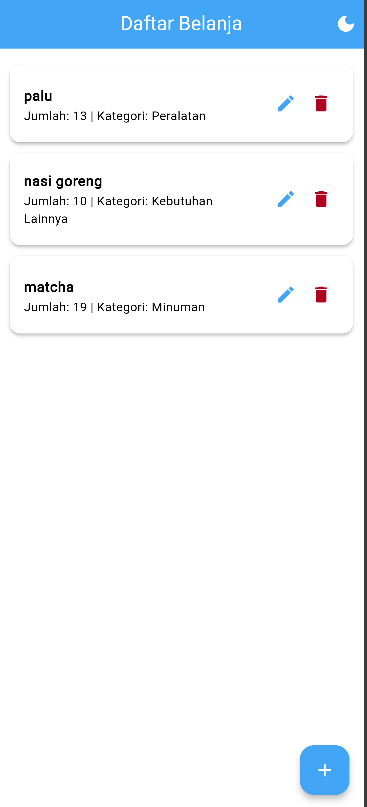
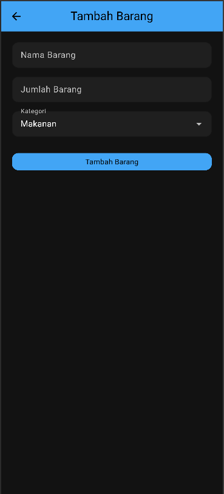
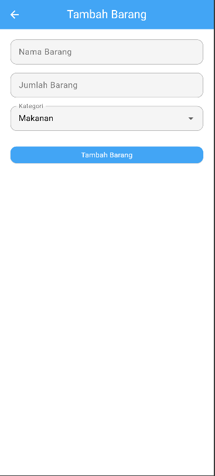

# Najmi Hafizh Mauludan Zain_2409116028_SI A`24

## Aplikasi Daftar Belanja 

### Deskripsi Aplikasi
Aplikasi Daftar Belanja merupakan aplikasi mobile sederhana yang dibuat menggunakan framework Flutter. Aplikasi ini digunakan untuk membantu pengguna mencatat barang-barang yang ingin dibeli, seperti makanan, minuman, peralatan rumah tangga, maupun kebutuhan lainnya.

Pada aplikasi ini pengguna dapat menambahkan daftar barang yang ingin dibeli, melihat daftar barang yang sudah dimasukkan, memperbarui data barang jika ada perubahan, serta menghapus barang yang sudah tidak diperlukan lagi. Seluruh data yang dimasukkan tidak disimpan secara lokal, tetapi langsung tersimpan pada database Supabase sehingga data dapat dikelola dengan lebih terstruktur.

---

### Fitur Aplikasi
Aplikasi ini memiliki beberapa fitur utama yang mendukung pengelolaan daftar belanja, yaitu:

- Menampilkan daftar barang belanja yang diambil langsung dari database Supabase.
- Menambahkan data barang baru ke dalam daftar belanja.
- Mengedit atau memperbarui informasi barang yang sudah ada.
- Menghapus data barang yang tidak diperlukan lagi.
- Menggunakan navigasi antar halaman untuk berpindah dari halaman daftar ke halaman form.
- Mendukung tampilan Light Mode dan Dark Mode sehingga pengguna dapat menggunakan aplikasi dengan tampilan yang lebih nyaman.

---

### Tampilan Aplikasi

#### Halaman Daftar Belanja
Halaman ini merupakan halaman utama yang menampilkan seluruh daftar barang belanja yang tersimpan pada database. Pada halaman ini pengguna dapat melihat nama barang, jumlah barang, serta kategori barang. Selain itu terdapat tombol untuk menambahkan barang baru dan juga tombol untuk mengedit atau menghapus data yang sudah ada.

#### Halaman Form Tambah / Edit Barang
Halaman ini digunakan untuk memasukkan data barang baru ataupun memperbarui data barang yang sudah ada. Pengguna dapat mengisi nama barang, jumlah barang, serta memilih kategori barang melalui pilihan yang tersedia.

---

## Widget yang Digunakan
Dalam pembuatan aplikasi ini digunakan beberapa widget bawaan Flutter untuk membangun tampilan antarmuka aplikasi, di antaranya:

- **MaterialApp** digunakan sebagai dasar dari aplikasi Flutter.
- **Scaffold** digunakan untuk membuat struktur dasar halaman.
- **AppBar** digunakan untuk menampilkan bagian header atau navbar aplikasi.
- **ListView** digunakan untuk menampilkan daftar data secara vertikal.
- **Card** digunakan untuk menampilkan setiap item barang agar terlihat lebih rapi.
- **ListTile** digunakan untuk menampilkan informasi barang dalam bentuk daftar.
- **TextField** digunakan untuk input data seperti nama dan jumlah barang.
- **DropdownButtonFormField** digunakan untuk memilih kategori barang.
- **ElevatedButton** digunakan sebagai tombol untuk menyimpan data.
- **FloatingActionButton** digunakan sebagai tombol untuk menambahkan data baru.
- **IconButton** digunakan untuk tombol edit dan delete pada setiap item.
- **SnackBar** digunakan untuk menampilkan notifikasi kepada pengguna.

Selain widget bawaan Flutter, aplikasi ini juga menggunakan beberapa **custom widget** agar kode lebih terstruktur dan mudah digunakan kembali, yaitu:
- **CustomButton**
- **CustomTextField**

---

## Struktur Project
Struktur folder pada project ini dibuat untuk memisahkan bagian-bagian penting dalam aplikasi agar kode lebih mudah dipahami dan dikelola.

lib:
models:
- shopping_item.dart

pages:
- home_page.dart
- form_page.dart

services:
- supabase_service.dart

themes:
- app_theme.dart

widgets:
- custom_button.dart
- custom_textfield.dart
  
main.dart

-**models** berisi struktur data yang digunakan dalam aplikasi.
-**pages** berisi halaman-halaman utama aplikasi.
-**services** berisi kode yang digunakan untuk berkomunikasi dengan database Supabase.
-**themes** berisi pengaturan tampilan aplikasi seperti warna dan mode terang/gelap.
-**widgets** berisi widget tambahan yang dibuat sendiri untuk mempermudah penggunaan komponen UI.

---

## Teknologi yang Digunakan
Beberapa teknologi yang digunakan dalam pembuatan aplikasi ini antara lain:

- **Flutter** sebagai framework untuk membangun aplikasi mobile.
- **Dart** sebagai bahasa pemrograman yang digunakan pada Flutter.
- **Supabase** sebagai database backend untuk menyimpan data aplikasi.
- **Material Design** untuk membuat tampilan antarmuka aplikasi.

---
